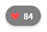

## Heart Rate Monitor

This tool reads heart rate data from HRS (Heart Rate Service) compatible
devices (e.g., smart bands) and launches an HTTP service, allowing you to
display real-time heart rate metrics in OBS Studio for live streaming or
recordings.



## Features

- Connects to compatible heart rate monitoring devices (MiBand 10 and similar)
- Provides real-time heart rate data via HTTP endpoint
- Customizable HTTP server port
- Simple integration with OBS Studio using Browser Source
- Customizable heart rate UI
- Cross-platform support (Windows, macOS, Linux)
- Automatic reconnection

## Usage
1. Download the binary and `themes.zip` from release.
1. Extract `themes.zip`.
1. Place the extracted folder with the binary files together.
1. The first time you run it, you need to set a default theme. Run this command
    ```bash
    hr-monitor --theme prominent
    ```
1. Everything is ready, run it.

For more feature, run
```bash
hr-monitor --help
```

## About Customize UI
There are some variables that can be used in the HTML file to replace runtime information(such as listening port).
The variable name must enclosed in "\${{}}" (e.g. `${{PORT}}`).

#### Available variables
| Name | Description |
| --- | --- |
| PORT | HTTP server listening port |

## Acknowledgments

This project was inspired by and builds upon the work of
[miband-heart-rate](https://github.com/Tnze/miband-heart-rate).
Special thanks to the original author for their Bluetooth LE implementation.
